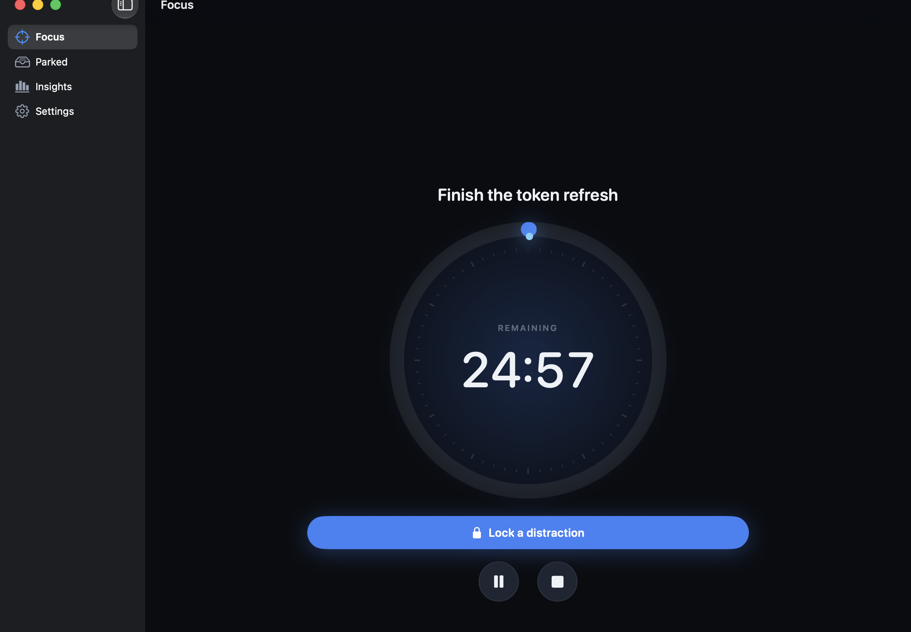

# Anchor

A focus timer that takes distractions seriously.

You set an anchor — the thing you're actually trying to do — and start a timer.
When something pulls at you, one keystroke parks it: you name it in a sentence,
it's filed, and you're handed back your goal and the time remaining. Afterwards
Anchor tells you what actually costs you your focus.

Runs on macOS, iOS and Apple Watch from one shared codebase. The app is local-first;
distraction text always stays on your device.



## What it does

- **Focus timer** with a goal, wall-clock accurate across relaunch, sleep and sync.
  Planned sessions end automatically and post a local notification.
- **Lock a distraction** (`⌘⇧L`) — name it, park it, keep working. Or record
  honestly that it won.
- **Resuming asks what pulled you away.** A pause is usually an interruption, so
  coming back captures it — with "nothing, just a break" one key away.
- **A compact version** that lives in the menu bar, or as a floating mini timer
  (`⌘0`). Start, pause, resume, capture and end without opening the main window.
- **Apple Watch** as a remote: start, pause, and catch the interruption at the
  moment it happens without picking anything up.
- **Sync** through your own private iCloud database, plus optional Significant
  Hobbies Hub session summaries after you connect.
- **On-device tagging** — Apple Intelligence sorts goals into themes and
  distractions into categories, so analytics work without you tagging anything.
- **Analytics** — where your hours and billable value go, what interrupts you,
  project and tag breakdowns, session depth, weekday rhythm, and active time that
  was not covered by a session.
- **Export** — real `.xlsx`, CSV, JSON.
- **MCP server** — point Codex at your focus history and just ask.

Landing, support and privacy pages: <https://anchor.significanthobbies.com> — built and
released from the shared `ios-landings` factory (`products/anchor/`), not from this repo.

## Requirements

macOS 26 / iOS 26 / watchOS 26 or later, Xcode 27. Apple Intelligence is optional:
without it, tagging falls back to built-in rules and the app is otherwise
unchanged. Apple Watch never has it, so anything captured there is refined by the
phone or Mac once it syncs.

## Build and run

```bash
# Shared package: builds and tests from the command line, no Xcode needed
swift build
swift test

# App targets
cd Apps && xcodegen generate && open Anchor.xcodeproj
```

Pick the **Anchor (macOS)**, **Anchor (iOS)** or **Anchor (watchOS)** scheme and run.

CloudKit sync and the shared app group are entitlements, so the default `Debug`
and `Release` configurations sign against the team. If this machine isn't
registered in the developer account yet, build the `DebugLocal` configuration —
it drops entitlements and signing, and the store falls back to local-only:

```bash
xcodebuild -project Apps/Anchor.xcodeproj -scheme "Anchor (macOS)" \
  -configuration DebugLocal build
```

To explore with three weeks of plausible history instead of an empty database:

```bash
ANCHOR_DEMO_DATA=1 ./path/to/Anchor.app/Contents/MacOS/Anchor
```

Demo data is only ever written into an empty store.

## Releasing

```bash
./scripts/release-mac.sh    # Developer ID signed, hardened Anchor-<v>.dmg
./scripts/release-ios.sh    # App Store signed Anchor-<v>.ipa, watch app embedded
```

Both write to `dist/` and verify what they produced — signature, hardened
runtime, entitlements, and (for iOS) that the watch app is really in the payload.

Finishing each one needs your Apple credentials:

```bash
# Notarise the DMG (once: store an app-specific password from appleid.apple.com)
xcrun notarytool store-credentials "anchor-notary" \
  --apple-id "<apple-id>" --team-id 8F7LXHTJZR --password "<app-specific-password>"
ANCHOR_NOTARY_PROFILE=anchor-notary ./scripts/release-mac.sh

# Upload the IPA — or just drag it into Transporter
xcrun altool --upload-app -f dist/Anchor-1.0.ipa -t ios \
  --apple-id "<apple-id>" --password "<app-specific-password>"
```

The Mac direct-download and iOS/watchOS builds use the same production CloudKit
container. Each distribution channel has its own provisioning profile, so the
restricted iCloud and app-group entitlements remain intact.

## Talking to your data

Anchor ships an MCP server, so an AI client can query your history directly
rather than making you export a file first.

```bash
swift build -c release
codex mcp add anchor -- "$PWD/.build/release/anchor-mcp"
```

Then ask things like *"what broke my focus most this month?"* or *"which goal do I
protect best?"*. Nine read-only tools; see [`docs/mcp-and-export.md`](docs/mcp-and-export.md).

Check that on-device tagging is working on your machine:

```bash
./.build/release/anchor-mcp --diagnose
```

## Layout

```
Sources/
  AnchorCore/     models, timing, tagging, analytics, export — no UI, fully tested
  AnchorUI/       SwiftUI screens and the design system, shared by both apps
  anchor-mcp/     stdio MCP server over the same store
Apps/
  Mac/ iOS/ Watch/  thin app shells; project.yml generates the Xcode project
  Shared/          asset catalog (accent colour + app icon)
Tests/            87 tests, no Xcode required
```

## Documentation

- [Architecture](docs/architecture.md) — how the pieces fit and why
- [MCP and export](docs/mcp-and-export.md) — tools, formats, the hand-written xlsx writer
- [Decisions](docs/decisions.md) — the calls made along the way, and what they cost

## Privacy

Distraction notes are the most personal thing in the app, so they never leave the
device. Tagging and summarising run against Apple's on-device model. SwiftData
and private CloudKit remain local-first storage. If you explicitly connect
Significant Hobbies, Anchor also sends only the goal, start and end times,
focused duration, outcome, and interruption count to your private Significant
Hobbies Hub. There is no analytics SDK.
